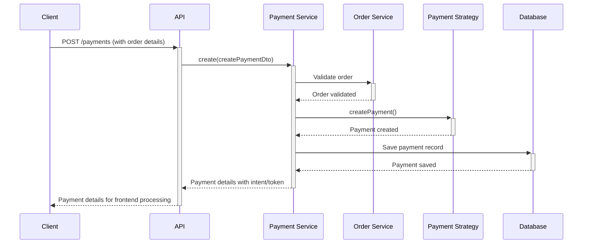
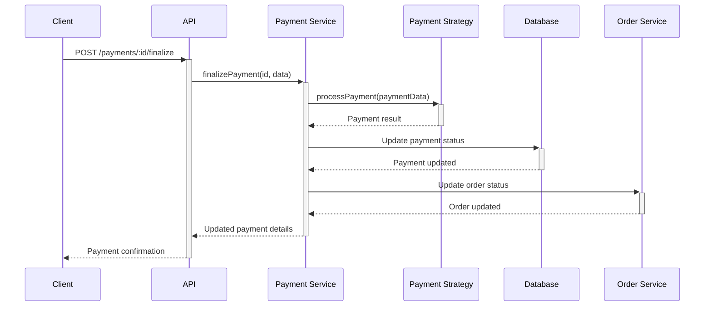
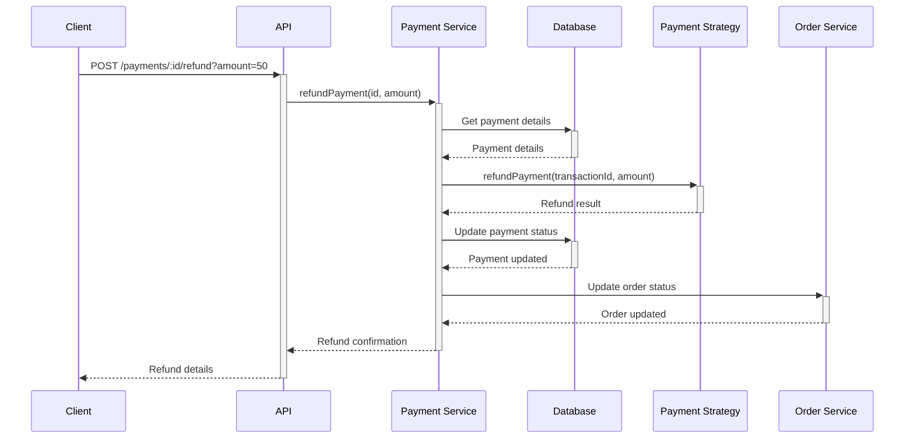

# Payment Integration Guide

This document provides comprehensive details about the payment integration in the E-commerce backend system.

## Table of Contents

1. [Overview](#overview)
2. [Payment Architecture](#payment-architecture)
3. [Supported Payment Providers](#supported-payment-providers)
4. [Integration Process](#integration-process)
5. [Payment Flow](#payment-flow)
6. [Webhooks & Notifications](#webhooks--notifications)
7. [Refund Processing](#refund-processing)
8. [Security Considerations](#security-considerations)
9. [Testing Guide](#testing-guide)
10. [API Reference](#api-reference)

## Overview

The E-commerce backend implements a flexible payment processing system that supports multiple payment providers. The system is designed with a strategy pattern, allowing easy addition of new payment processors without changing the core payment logic.

## Payment Architecture

The payment system follows the Strategy design pattern, which allows the application to dynamically select a payment processor at runtime based on the customer's choice:

```
┌─────────────────┐       ┌─────────────────┐
│ PaymentService  │─────▶ │ PaymentStrategy │
└─────────────────┘       └────────┬────────┘
                                   │
                 ┌─────────────────┼─────────────────┐
                 │                 │                 │
        ┌────────▼─────┐  ┌────────▼─────┐  ┌────────▼─────┐
        │ Stripe       │  │ PayPal       │  │ Other        │
        │ Strategy     │  │ Strategy     │  │ Strategies   │
        └──────────────┘  └──────────────┘  └──────────────┘
```

### Key Components

1. **PaymentEntity**: Stores payment records with transaction details
2. **PaymentService**: Manages payment operations and uses strategies
3. **PaymentStrategy**: Interface defining common methods for all payment processors
4. **Provider-specific Strategies**: Implementation for each payment provider

## Supported Payment Providers

The system currently supports the following payment providers:

### Stripe

- **Features**:
  - Credit/debit card processing
  - Payment intents with 3D Secure
  - Webhooks for asynchronous events
  - Refund capabilities

- **Configuration**:
  ```env
  STRIPE_SECRET_KEY=your_stripe_secret_key
  STRIPE_PUBLIC_KEY=your_stripe_public_key
  STRIPE_WEBHOOK_SECRET=your_stripe_webhook_secret
  ```

### PayPal

- **Features**:
  - Express checkout
  - PayPal wallet payments
  - IPN (Instant Payment Notification)
  - Refund capabilities

- **Configuration**:
  ```env
  PAYPAL_CLIENT_ID=your_paypal_client_id
  PAYPAL_CLIENT_SECRET=your_paypal_client_secret
  PAYPAL_MODE=sandbox  # or 'live' for production
  ```

### Adding New Providers

To add a new payment provider:

1. Create a new strategy class that implements `PaymentStrategy` interface
2. Register the strategy in the `PaymentService` constructor
3. Add new enum values to `PaymentProvider`
4. Configure environment variables for the new provider

## Integration Process

### Step 1: Configuration

Ensure all necessary configuration is set in environment variables:

```env
# Stripe Configuration
STRIPE_SECRET_KEY=your_stripe_secret_key
STRIPE_PUBLIC_KEY=your_stripe_public_key
STRIPE_WEBHOOK_SECRET=your_stripe_webhook_secret

# PayPal Configuration
PAYPAL_CLIENT_ID=your_paypal_client_id
PAYPAL_CLIENT_SECRET=your_paypal_client_secret
PAYPAL_MODE=sandbox  # or 'live' for production
```

### Step 2: Set Up Dependencies

Install the required packages:

```bash
# For Stripe
npm install stripe

# For PayPal
npm install @paypal/checkout-server-sdk
```

### Step 3: Update Implementation

For Stripe, update the `StripePaymentStrategy` class to use the actual Stripe SDK:

```typescript
import Stripe from 'stripe';

@Injectable()
export class StripePaymentStrategy implements PaymentStrategy {
  private readonly stripe: Stripe;

  constructor(private configService: ConfigService) {
    const secretKey = this.configService.get<string>(
      'payment.stripe.secretKey',
    );
    this.stripe = new Stripe(secretKey, {
      apiVersion: '2023-10-16',
    });
  }

  // Implementation methods
}
```

Similarly, for PayPal, update the PayPal strategy with the actual SDK implementation.

## Payment Flow

### 1. Creating a Payment



#### Example Request

```javascript
// POST /api/payments
{
  "orderId": "1234-5678-90ab-cdef",
  "amount": 99.99,
  "provider": "stripe",
  "currency": "USD",
  "description": "Order #1001"
}
```

#### Example Response (Stripe)

```javascript
{
  "id": "payment-uuid",
  "orderId": "1234-5678-90ab-cdef",
  "amount": 99.99,
  "provider": "stripe",
  "status": "pending",
  "paymentIntentId": "pi_123456789",
  "details": {
    "clientSecret": "pi_123456789_secret_123456"
  }
}
```

### 2. Finalizing a Payment



## Webhooks & Notifications

Payment providers send asynchronous notifications about payment status changes that need to be handled:

### 1. Stripe Webhook Handler

```typescript
// POST /api/payments/webhook/stripe
@Post('webhook/stripe')
@HttpCode(200)
processStripeWebhook(@Body() payload: any, @Headers('stripe-signature') signature: string) {
  return this.paymentService.processWebhook('stripe', payload, signature);
}
```

### 2. PayPal IPN Handler

```typescript
// POST /api/payments/webhook/paypal
@Post('webhook/paypal')
@HttpCode(200)
processPayPalWebhook(@Body() payload: any) {
  return this.paymentService.processWebhook('paypal', payload, null);
}
```

### Webhook Security

- Always verify webhook signatures (e.g., Stripe's stripe-signature header)
- Validate event types before processing
- Implement idempotency to prevent duplicate processing

## Refund Processing

The system supports both full and partial refunds:



## Security Considerations

### PCI Compliance

- Never store full credit card details on the server
- Use tokenization services provided by payment gateways
- Implement HTTPS for all communication

### API Key Management

- Store API keys securely in environment variables
- Use different API keys for development and production
- Rotate keys periodically

### Transaction Security

- Validate order details before initiating payment
- Implement rate limiting on payment endpoints
- Log all payment activities for audit

## Frontend Integration Guide

### Integrating Stripe with React

Here's a simple example of how to integrate Stripe in a React frontend:

```jsx
import { useState } from 'react';
import { CardElement, useStripe, useElements } from '@stripe/react-stripe-js';
import axios from 'axios';

export const CheckoutForm = ({ orderId, amount }) => {
  const stripe = useStripe();
  const elements = useElements();
  const [error, setError] = useState(null);
  const [loading, setLoading] = useState(false);

  const handleSubmit = async (e) => {
    e.preventDefault();
    setLoading(true);

    if (!stripe || !elements) {
      setLoading(false);
      return;
    }

    try {
      // 1. Create a payment on the server
      const { data } = await axios.post('/api/payments', {
        orderId,
        amount,
        provider: 'stripe',
      });

      // 2. Confirm the payment with Stripe.js
      const result = await stripe.confirmCardPayment(
        data.details.clientSecret,
        {
          payment_method: {
            card: elements.getElement(CardElement),
            billing_details: {
              name: 'Customer Name',
            },
          },
        },
      );

      if (result.error) {
        setError(result.error.message);
      } else if (result.paymentIntent.status === 'succeeded') {
        // 3. Finalize the payment on the server
        await axios.post(`/api/payments/${data.id}/finalize`, {
          paymentIntentId: result.paymentIntent.id,
        });

        // Payment successful - redirect or show success
        window.location.href = '/order/success';
      }
    } catch (err) {
      setError(err.response?.data?.message || err.message);
    } finally {
      setLoading(false);
    }
  };

  return (
    <form onSubmit={handleSubmit}>
      <CardElement />
      {error && <div className="error">{error}</div>}
      <button disabled={!stripe || loading}>Pay ${amount}</button>
    </form>
  );
};
```

### Integrating PayPal with React

Here's how to integrate PayPal in a React frontend:

```jsx
import { useEffect } from 'react';
import axios from 'axios';

export const PayPalCheckout = ({ orderId, amount }) => {
  useEffect(() => {
    // Create a payment on the server
    const createOrder = async () => {
      const { data } = await axios.post('/api/payments', {
        orderId,
        amount,
        provider: 'paypal',
      });

      // Redirect to PayPal approval URL
      window.location.href = data.details.approvalUrl;
    };

    createOrder();
  }, [orderId, amount]);

  return <div>Redirecting to PayPal...</div>;
};
```

On your success page or PayPal return URL handler:

```jsx
import { useEffect } from 'react';
import { useParams, useSearchParams } from 'react-router-dom';
import axios from 'axios';

export const PayPalSuccessPage = () => {
  const { paymentId } = useParams();
  const [searchParams] = useSearchParams();
  const payerId = searchParams.get('PayerID');

  useEffect(() => {
    const finalizePayment = async () => {
      try {
        await axios.post(`/api/payments/${paymentId}/finalize`, {
          PayerID: payerId,
        });
        // Show success message
      } catch (error) {
        // Handle error
        console.error('Payment finalization failed:', error);
      }
    };

    if (payerId) {
      finalizePayment();
    }
  }, [paymentId, payerId]);

  return <div>Processing your payment...</div>;
};
```

## Testing Guide

### Local Testing

1. Use sandbox/test environments for payment providers
2. Create test accounts for each payment provider
3. Use test credit cards (Stripe provides test card numbers)

### Stripe Test Cards

| Card Number         | Description              |
| ------------------- | ------------------------ |
| 4242 4242 4242 4242 | Successful payment       |
| 4000 0000 0000 3220 | 3D Secure authentication |
| 4000 0000 0000 9995 | Declined payment         |

### PayPal Sandbox

1. Create a PayPal developer account
2. Set up sandbox business and personal accounts
3. Use sandbox credentials in your development environment

### Testing Webhooks Locally

1. Use tools like ngrok to expose your local server
2. Configure webhook URLs in payment provider dashboards to point to your ngrok URL
3. Trigger test events from provider dashboards

## API Reference

### Create Payment

**Endpoint:** `POST /api/payments`

**Authentication Required:** Yes

**Request Body:**

```json
{
  "orderId": "string",
  "amount": "number",
  "provider": "string (stripe|paypal|credit_card|bank_transfer)",
  "currency": "string",
  "description": "string"
}
```

**Response:** `201 Created`

```json
{
  "id": "string",
  "orderId": "string",
  "amount": "number",
  "provider": "string",
  "status": "string",
  "transactionId": "string",
  "paymentIntentId": "string",
  "paymentDetails": "object",
  "createdAt": "date"
}
```

### Finalize Payment

**Endpoint:** `POST /api/payments/:id/finalize`

**Authentication Required:** Yes

**Request Body:** Provider-specific payment data

**Response:** `200 OK`

```json
{
  "id": "string",
  "orderId": "string",
  "status": "string",
  "transactionId": "string",
  "updatedAt": "date"
}
```

### Process Webhook

**Endpoint:** `POST /api/payments/webhook/:provider`

**Authentication Required:** No (uses provider-specific verification)

**Request Body:** Provider-specific webhook payload

**Response:** `200 OK`

```json
{
  "received": true
}
```

### Refund Payment

**Endpoint:** `POST /api/payments/:id/refund`

**Authentication Required:** Yes (Admin only)

**Query Parameters:**

- `amount`: Optional, for partial refunds

**Response:** `200 OK`

```json
{
  "id": "string",
  "orderId": "string",
  "status": "string",
  "refundId": "string",
  "refundAmount": "number",
  "updatedAt": "date"
}
```

## Frontend Integration

### Stripe Elements

```javascript
// 1. Get payment intent client secret from backend
const { data } = await axios.post('/api/payments', {
  orderId: 'order-123',
  amount: 99.99,
  provider: 'stripe',
});

// 2. Set up Stripe Elements
const stripe = Stripe('your-stripe-public-key');
const elements = stripe.elements();
const card = elements.create('card');
card.mount('#card-element');

// 3. Handle form submission
const result = await stripe.confirmCardPayment(data.details.clientSecret, {
  payment_method: {
    card: card,
  },
});

// 4. Finalize payment on backend
await axios.post(`/api/payments/${data.id}/finalize`, {
  paymentIntentId: result.paymentIntent.id,
  status: result.paymentIntent.status,
});
```

### PayPal Checkout

```javascript
// 1. Get PayPal order ID from backend
const { data } = await axios.post('/api/payments', {
  orderId: 'order-123',
  amount: 99.99,
  provider: 'paypal',
});

// 2. Set up PayPal button
paypal
  .Buttons({
    createOrder: () => {
      return data.paymentDetails.orderId;
    },
    onApprove: async (data, actions) => {
      // 3. Finalize payment on backend
      await axios.post(`/api/payments/${data.id}/finalize`, {
        paypalOrderId: data.orderID,
      });
    },
  })
  .render('#paypal-button-container');
```

## Conclusion

The payment system is designed to be flexible, secure, and extensible. By following the strategy pattern, new payment providers can be easily integrated without modifying existing code. Always prioritize security when dealing with payment information, and follow best practices for handling sensitive customer data.

For any questions or issues, please contact the development team.
